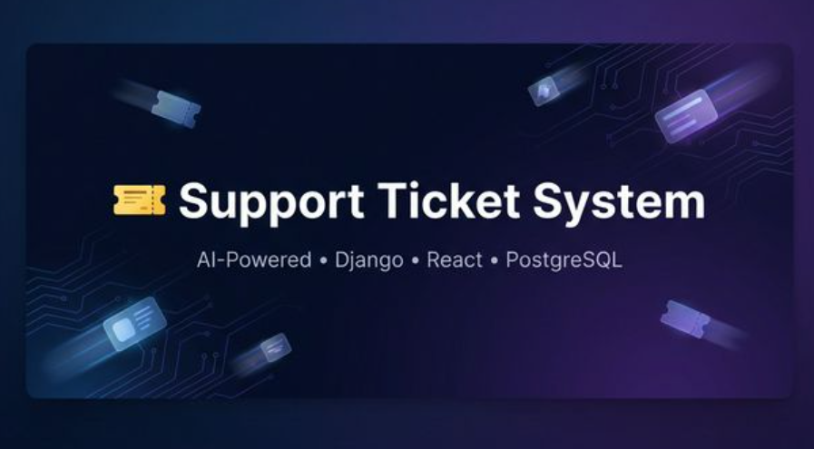
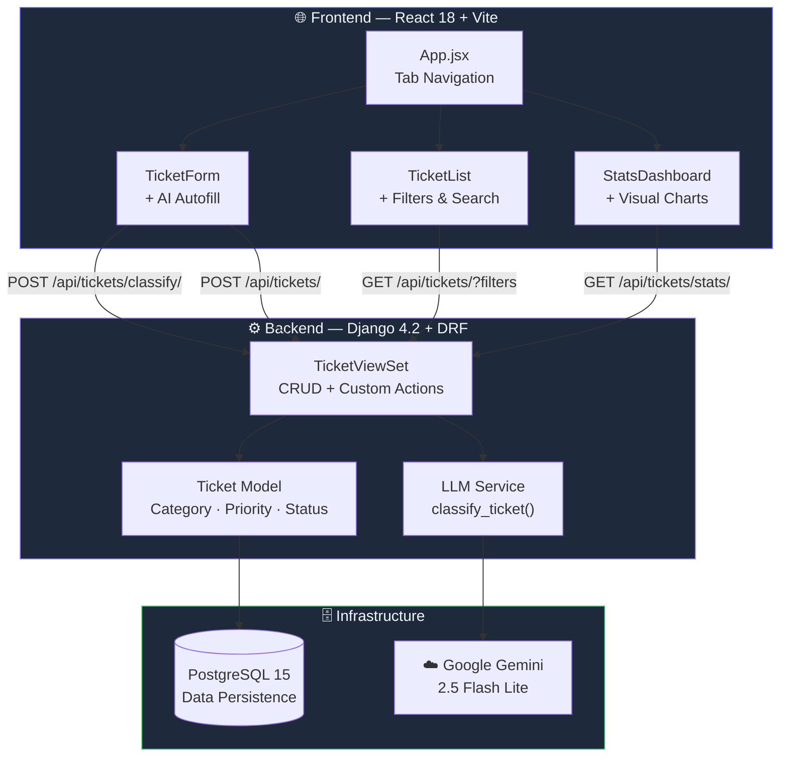

<div align="center">

<!-- 🔹 BANNER — replace the src below with your own hosted banner image -->
<!--  -->

# 🎫 Support Ticket System

### _AI-Powered Ticket Classification & Management_

[](https://www.djangoproject.com/)
[](https://react.dev/)
[](https://www.postgresql.org/)
[](https://ai.google.dev/)
[](https://docs.docker.com/compose/)
[](https://vitejs.dev/)

<br/>

<p align="center">
  <b>A sleek, full-stack helpdesk platform that uses Google Gemini AI to automatically classify support tickets by category and priority — in real time as you type.</b>
</p>

<br/>

[🚀 Quick Start](#-quick-start) · [✨ Features](#-features) · [🏗️ Architecture](#️-architecture) · [📡 API Reference](#-api-reference) · [🧠 AI Classification](#-ai-classification) · [🎨 Design Decisions](#-design-decisions)

---

</div>

<br/>

## ✨ Features

<table>
<tr>
<td width="50%">

### 🤖 AI-Powered Classification
Real-time ticket classification using **Gemini 2.5 Flash Lite**. As users type a description _(debounced at 1s, min 20 chars)_, the AI suggests a **category** and **priority** — pre-filling the form instantly.

</td>
<td width="50%">

### 📊 Analytics Dashboard
DB-level aggregated statistics with visual bar charts — total tickets, open count, daily averages, and breakdowns by **priority** and **category**. No Python loops; pure Django ORM.

</td>
</tr>
<tr>
<td width="50%">

### 🔍 Smart Filtering & Search
Multi-parameter filtering by **category**, **priority**, and **status** — plus full-text search across titles and descriptions. All query params, all composable.

</td>
<td width="50%">

### 🛡️ Graceful Degradation
If the AI is unavailable, the API key is missing, or the response is malformed — the system falls back silently. Users can always submit tickets manually. Zero downtime, zero errors.

</td>
</tr>
<tr>
<td width="50%">

### 🎨 Dark Mode UI
A stunning dark-themed interface built with a custom CSS design system — gradient accents, glassmorphism cards, smooth micro-animations, and a fully responsive layout.

</td>
<td width="50%">

### 🐳 One-Command Deploy
Fully containerized with **Docker Compose**. PostgreSQL, Django + Gunicorn, and React + Vite — all spun up with a single `docker-compose up --build`.

</td>
</tr>
</table>

<br/>

## 🏗️ Architecture



<br/>

## 🚀 Quick Start

### Prerequisites

| Requirement | Version |
|---|---|
| 🐳 Docker + Docker Compose | Latest |
| 🔑 Google Gemini API Key | [Get one here](https://aistudio.google.com/apikey) |

### 1️⃣ Clone & Enter

```bash
git clone https://github.com/<your-username>/support-ticket-system.git
cd support-ticket-system
```

### 2️⃣ Configure Environment

Create a `.env` file in the project root:

```env
GEMINI_API_KEY=your-gemini-api-key-here
POSTGRES_DB=tickets_db
POSTGRES_USER=postgres
POSTGRES_PASSWORD=postgres
```

### 3️⃣ Launch

```bash
docker-compose up --build
```

### 4️⃣ Open

| Service | URL |
|---|---|
| 🖥️ Frontend | [`http://localhost:5173`](http://localhost:5173) |
| ⚙️ Backend API | [`http://localhost:8000/api/`](http://localhost:8000/api/) |

> [!TIP]
> The Vite dev server proxies `/api` requests to the Django backend automatically — no CORS headaches during development.

<br/>

## 📡 API Reference

| Method | Endpoint | Description |
|:---:|---|---|
| `POST` | `/api/tickets/` | Create a new ticket |
| `GET` | `/api/tickets/` | List tickets _(supports filters + search)_ |
| `PATCH` | `/api/tickets/<id>/` | Update a ticket's status |
| `GET` | `/api/tickets/stats/` | Aggregated statistics _(DB-level)_ |
| `POST` | `/api/tickets/classify/` | AI-powered classification |

<details>
<summary><b>🔎 Filtering & Search Examples</b></summary>

<br/>

**Filter by category:**
```
GET /api/tickets/?category=technical
```

**Filter by priority + status:**
```
GET /api/tickets/?priority=high&status=open
```

**Full-text search:**
```
GET /api/tickets/?search=login+issue
```

**Combine everything:**
```
GET /api/tickets/?category=billing&priority=critical&status=open&search=refund
```

</details>

<details>
<summary><b>🤖 Classify Endpoint</b></summary>

<br/>

**Request:**
```json
POST /api/tickets/classify/
{
  "description": "I can't log into my account after resetting my password"
}
```

**Response:**
```json
{
  "suggested_category": "account",
  "suggested_priority": "high"
}
```

</details>

<br/>

## 🧠 AI Classification

<table>
<tr>
<td width="30%" align="center">

**Model**<br/>
`Gemini 2.5 Flash Lite`

</td>
<td width="30%" align="center">

**Temperature**<br/>
`0.1` _(deterministic)_

</td>
<td width="30%" align="center">

**Max Tokens**<br/>
`50` _(JSON only)_

</td>
</tr>
</table>

### How It Works

```
User types description ──► Debounce (1s) ──► POST /classify/ ──► Gemini API ──► JSON response
                                                                                      │
                                                          ┌──────────────────────────────┘
                                                          ▼
                                                Pre-fill Category & Priority dropdowns
                                                (user can always override suggestions)
```

### Why Gemini 2.5 Flash Lite?

- ⚡ **Ultra-fast** — sub-second response times for real-time classification
- 💰 **Cost-effective** — optimized for lightweight tasks without sacrificing quality
- 🎯 **Reliable structured output** — low temperature + constrained prompt = consistent JSON
- 🔄 **Graceful fallback** — if the API fails, the system continues without interruption

### Categories & Priorities

| Category | Examples |
|---|---|
| 💳 `billing` | Payment issues, invoices, refunds, subscription billing |
| 🔧 `technical` | Bugs, errors, crashes, performance issues |
| 👤 `account` | Login issues, password resets, profile changes |
| 📬 `general` | General inquiries, feedback, feature requests |

| Priority | When to use |
|---|---|
| 🟢 `low` | Minor issues, general questions |
| 🟡 `medium` | Standard issues needing attention |
| 🟠 `high` | Affecting user workflow or experience |
| 🔴 `critical` | System outages, security issues, data loss |

<br/>

## 🎨 Design Decisions

<table>
<tr>
<td>🗃️</td>
<td><b>DB-Level Aggregation</b></td>
<td>Stats use Django ORM <code>annotate()</code> and <code>Count()</code> — zero Python loops for aggregation. The DB does the heavy lifting.</td>
</tr>
<tr>
<td>⏱️</td>
<td><b>Debounced Classification</b></td>
<td>LLM calls fire after 1 second of inactivity (min 20 chars) — balancing responsiveness with API cost.</td>
</tr>
<tr>
<td>🧩</td>
<td><b>Model ViewSet + Actions</b></td>
<td>Single <code>TicketViewSet</code> with <code>@action</code> decorators for <code>/stats/</code> and <code>/classify/</code> — clean, DRY, extensible.</td>
</tr>
<tr>
<td>🔀</td>
<td><b>Proxy-Based API Routing</b></td>
<td>Vite proxy handles frontend → backend routing in dev. CORS headers configured for flexibility in production.</td>
</tr>
<tr>
<td>📝</td>
<td><b>Structured LLM Prompt</b></td>
<td>Constrained output format with explicit valid choices + JSON-only response format = predictable results.</td>
</tr>
<tr>
<td>✅</td>
<td><b>DB-Level Constraints</b></td>
<td><code>CheckConstraint</code> on category, priority, and status fields — data integrity enforced at the database level.</td>
</tr>
</table>

<br/>

## 📁 Project Structure

```
support-ticket-system/
│
├── 🐍 backend/
│   ├── config/                 # Django project settings & URLs
│   ├── tickets/
│   │   ├── models.py           # Ticket model with DB constraints
│   │   ├── views.py            # ViewSet + /stats/ & /classify/ actions
│   │   ├── serializers.py      # DRF serializers
│   │   ├── llm_service.py      # Gemini AI classification logic
│   │   └── urls.py             # Router configuration
│   ├── Dockerfile              # Python 3.11 + Gunicorn
│   ├── requirements.txt        # Django, DRF, google-generativeai, etc.
│   └── entrypoint.sh           # Auto-migrate + launch Gunicorn
│
├── ⚛️ frontend/
│   ├── src/
│   │   ├── components/
│   │   │   ├── TicketForm.jsx  # AI-autofill ticket creation form
│   │   │   ├── TicketList.jsx  # Filterable, searchable ticket list
│   │   │   └── StatsDashboard.jsx  # Visual analytics dashboard
│   │   ├── api.js              # Axios HTTP client module
│   │   ├── App.jsx             # Main app with tab navigation
│   │   └── index.css           # Dark theme design system (575 lines)
│   ├── Dockerfile              # Node 20 + Vite dev server
│   └── vite.config.js          # Proxy config for /api → backend
│
├── docker-compose.yml          # PostgreSQL + Backend + Frontend
├── .env                        # Environment variables
└── README.md                   # You are here ✨
```

<br/>

## 🛠️ Tech Stack

<div align="center">

| Layer | Technology | Purpose |
|:---:|:---:|---|
| **Backend** |   | REST API, ORM, ViewSets |
| **Frontend** |   | SPA with hot reload |
| **Database** |  | Relational storage + constraints |
| **AI/LLM** |  | Real-time ticket classification |
| **Infra** |   | Containerized orchestration |

</div>

<br/>

---

<div align="center">

**Built with ❤️ and a lot of ☕**

<sub>If you found this useful, consider giving it a ⭐</sub>

</div>
